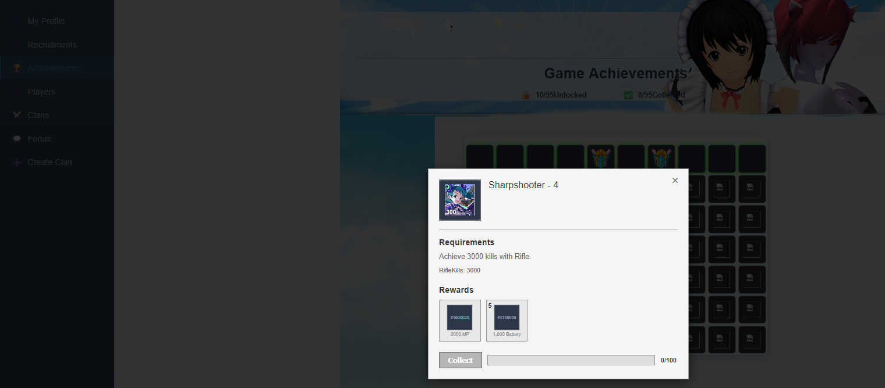

## MV Overvolts Overview

The MVO  Server handles various in-game reward mechanisms.
```
    |  \/  | \ \ / /  / _ \  
    | |\/| |  \ V /  | (_) | 
    |_|__|_|  _\_/_   \___/  
    _|"""""|_| """"|_|"""""| 
    `-0-0-'  `-0-0-'  `-0-0-` 
    
Microvolts OverVolt v 0.5
──────────────────────────────────────────────────────────────
```


## Features
- **Referral Wheel** 
- **Achievement system** 
- **Event Shop** 
- **daily playtime chest**
- **GUI** (in Progress)

## Development Status
The good news is that most of the features I wanted are in here!

The catch is that I haven't had a chance to write tests for everything yet, so some parts are definitely more stable than others. You might run into some flaky behavior. If you find a bug, please let me know by opening an issue! 

### GUI Status
The web interface is technically there, but the CSS is having an identity crisis. The scaling is completely off and it's not responsive in the slightest. It's functional enough for testing, but you might need to squint a bit.



*The achievement system works great via API, but the GUI needs some TLC*
> **⏸ Development Pause**: I'll be busy for the next month, so active development is on halt. The current version is somewhat useable, but major fixes will have to wait.

> See [TODO.md](./TODO.md) for upcoming tasks and planned improvements.


## Usability
- **API**:  can be tested via tools like Postman
- Sends rewards via API requests to the [MicrovoltsEmulator](https://github.com/SoWeBegin/MicrovoltsEmulator)


## Documentation

For a complete guide on setup, configuration, and API usage,  see the **[Full User Manual](./docs/README.md)**.


  
